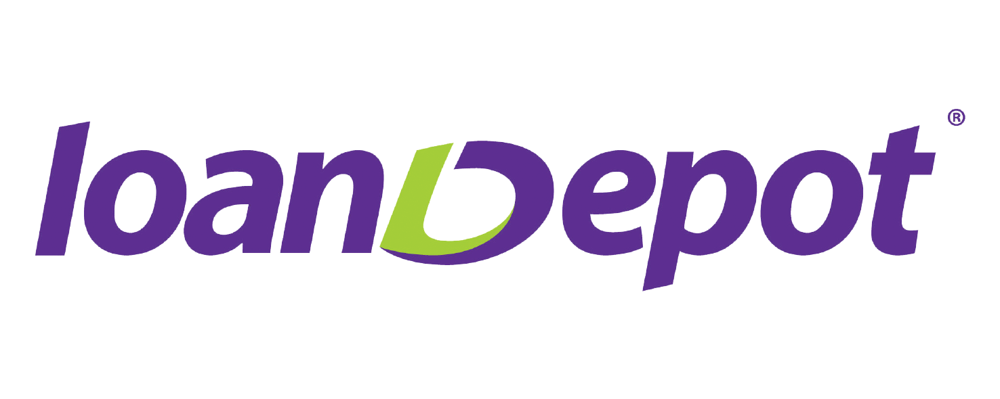

# loanDepot Case Study
Jeff O'Neal
 
# Overview and Origin

## What is the name of the company?

[loanDepot.com](loandepot.com) or LDI

## When was the company incorporated?

Originally founded in 2010.

## Who are the founders of the company?

Anthony Hsieh, Founder and original CEO

Parthenon Capital Partners, original private equity round investors.

## How did the idea for the company (or project) come about?

Hsieh, a longtime mortgage CEO created loanDepot.com as a online mortgage lender in 2010. The company is the third tech/online forward mortgage lender that Hsieh has founded. In the early 1990's he founded loandirect.com which was then purchased by ETRADE in 2001. In 2002 Hseih founded HomeLoanCenter.com which was then acquired by Lending Tree in 2004. He served as the CEO of Lending Tree until 2007.

## How is the company funded? How much funding have they received?

loanDepot.com went through four funding rounds before their IP in February of 2021. In their first four funding rounds they aquired a total of $181.9M. Their first round was a private equity round in January of 2010 with Parthenon Capital Partners. The next two funding rounds were venture rounds in January of 2014 ($12.2M) and March of 2015 ($19.8M). In August of 2016 they raised $150M via a crowdlending fund. During their IPO LDI sold at a price of $14.00/share and raised a total of $54M on February 11, 2021. As of July 14, 2022 the stock price had dropped to $1.63.

# Business Activities

## What specific financial problem is the company or project trying to solve?

loanDepot.com is attempting to disrupt the mortgage industry by using technology to create a greater client experience. Through the development of mello Home they are attempting to connect pre-approved buyers to verified real estate agents in buyers local markets and help those buyers find and hire home improvement and other home pro's once they are in their home. mello was originally started in an attempt to streamline the loan process for borrowers by blending a digital and local relationship with their clients. The goal of mello Home is three fold, first is allowing clients to run their own mortgage or non-mortgage loan applications through funding from any device they own with the help of a loan consultant. Second they have consultants licensed in all states who can seamlessly respond and advise in real time to those clients that are digitally sourced and finally they can save the data and run analytics to get a better idea of what a consumer needs are the start of the home buying process well into the homeownership lifecycle.

## Who is the company's intended customer? Is there any information about the market size of this set of customers?

loanDepot.com's intended customer is any person in the United States that is already a homeowner (refinance) or any person in the United States currently looking to purchase a home using a mortgage.

## What solution does this company offer that their competitors do not or cannot offer? (What is the unfair advantage they utilize?)

loanDepot.com through the use of their mello initiative are attempting to create a less confusing purchasing process. Most homeowners want to go to one brand that will assist them throughout the entire home buying or refinancing process.

## Which technologies are they currently using, and how are they implementing them? (This may take a little bit of sleuthing–– you may want to search the company’s engineering blog or use sites like StackShare to find this information.)

loanDepot.com is currently using digital banking to assist with their clients in loan applications allowing them to share banking information from their bank to their new lender by securely providing their log in information so LDI can pull their bank statements without having to worry about downloading/uploading or faxing those items themselves. 

The company is also working on machine learning with their underwriting system in hopes to speed up the approval process.  By using computers to verify tax returns and verifying income instead of manual underwriters they are able to speed up the process of calculating income for self employed clients allowing their underwriting team to focus on other tasks.  
  
# Landscape

## What domain of the financial industry is the company in?

loanDepot.com is in the FinTech domains of Ditigtal Banking and Alternative Finance.

## What have been the major trends and innovations of this domain over the last 5–10 years?

The main trends that you see in the digital banking field are customer/client focused. Everything is being used to create a more user friendly and interactive experience. The data that these large organizations are collecting allow banks and organizations to serve a "segment of one" or using the data they have on each individual client to taylor advertisements and services that fit their need. A second area that has seen significant expansion in the domain is open banking which allows clients to more easily communicate between institutions in a secure fashion. Digital banking is also assisting in lowering the amount of physical assets a bank is required to own in order to operate through use of applications and other user facing technologies that require less overhead than a traditional bank branch but offer similar services. By using predictive models based on the historical data that banks collect they will be able to better predict their clients needs which will lead to a greater user experience and allow the lender/banks to better provide a universal cash management solution for their clients instead of simply a checking/savings account and a mortgage.

Some of the major innovations in the alternative financing domain have been the recent rise of crowdfunding, non-bank lenders and P2P lending.

## What are the other major companies in this domain?

Rocket Mortgage (formerly Quicken Loans), United Shore Financial (United Wholesale Mortgage), Wells Fargo, Freedom Mortgage and JPMorgan Chase are the five largest competitors in the mortgage industry.

# Results

## What has been the business impact of this company so far?

Despite only being a company for 12 years loanDepot.com has become America's third largest lender behind two organizations that were started in the mid 1980's.

## What are some of the core metrics that companies in this domain use to measure success? How is your company performing, based on these metrics?

The two major metrics used to measure success in the mortgage industry are total volume of loans funded and number of loans originated. Rocket Mortgage is the largest organization in terms of both volume and originations with 1.2M loans worth $340B in 2021. United Wholesale Mortgage was the second largest lender with 654,000 loans worth $227B. loandepot.com originated 390,000 loans worth $137B in the same year. Wells Fargo is the largest bank in the industry originating 361,000 loans worth $159B in 2021. Freedom Mortgage rounds out the top five originating 361,000 loans worth $89B in 2021.

## How is your company performing relative to competitors in the same domain?

While all mortgage lenders have seen a decline in business in 2022 due to the increase in interest rates loanDepot.com's stock has been affected more than other marjor lenders. Currently the YTD stock price for Rocket Mortgage has fallen approximately 39%, United Wholesale Mortgage has dropped 42.67% and Wells Fargo has dropped only around 19%. LDI has fallen nearly 69%.

# Recommendations

## If you were to advise the company, what products or services would you suggest they offer? (This could be something that a competitor offers, or use your imagination!)

I would advise that the organization use their mello platform to develop a client facing app under the same flagship that allows clients to track their monthly budgets. Through this app they would be able to expand their reach with their clients and build larger databases of information on them.

## Why do you think that offering this product or service would benefit the company?

By collecting additional data for their clients and prospective clients the company would better be able to predict their needs. Understanding their clients needs and making predictive models on the best course of action for their clients would allow them to better sell them on a wider variety of credit products in the future. It would also build trust with their clients, therefore assisting in building their brand even larger.

## What technologies would this additional product or service utilize?

Forward facing application development and digital banking would both be required to build this product. The company would need to build an application for their clients to log into and use digital banking technologies to share their banking information with the company so they could track their budget and build visual representations of their clients budgeting data.

## Why are these technologies appropriate for your solution?

These technologies would allow LDI to build a similar application to TrueBill which was acquired by Rocket Mortgage.  The application allows users to link their banking and credit card information to the application through digital banking portals and track spending, develop budgets, cancel subscriptions all while providing useful information to the company that they can then use to ensure they're selling the correct products to the correct clients when they are needed most by their clients.  That builds trust with the company, allows them to prove their value to their clients and in turn will increase profitability by lowering acquisition costs which are always the largest cost for these mortgage lenders. 